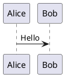
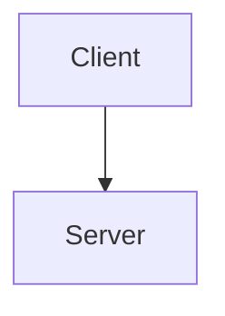

# Deployment Summary - Cisco Secure Client Documentation

## Status:  DEPLOYED

**URL**: https://ocproto.infra4.dev
**Kroki Local**: http://localhost:8000

## Infrastructure

- **Base Image**: node:22-trixie-slim + nginx:1.29-trixie-perl
- **Container Runtime**: Podman + crun
- **Orchestration**: Podman Compose (Compose Specification 2025)
- **Reverse Proxy**: Traefik with automatic HTTPS (Cloudflare DNS)
- **Diagram Service**: Kroki 0.25.0 (PlantUML, Mermaid, GraphViz, etc.)

## Services

### 1. Documentation (app)
- **Image**: localhost/cisco-secure-client-docs_app:latest
- **Container**: ocproto-docs
- **Resources**: 128MB RAM, 0.25 CPU
- **Networks**: traefik-public (external) + internal
- **Features**:
  - Docusaurus 3.5.2 static site
  - Client-side redirect from / to /docs/
  - Kroki integration for diagrams
  - Security headers (CSP, HSTS, etc.)
  - Gzip compression

### 2. Kroki Diagram Service (kroki)
- **Image**: docker.io/yuzutech/kroki:0.25.0
- **Container**: ocproto-kroki
- **Resources**: 512MB RAM, 0.5 CPU
- **Networks**: internal (isolated)
- **Exposed**: 127.0.0.1:8000 (localhost only)
- **Supported Formats**: 20+ diagram types

## Security Hardening

-  no-new-privileges:true
-  cap_drop: ALL (minimal capabilities added back as needed)
-  Log rotation (10MB × 3 files = 30MB max)
-  Resource limits (prevents OOM)
-  Non-root execution
-  Port 8000 bound to localhost only

## Important Fix: Redirect Issue

### Problem
Initially, accessing https://ocproto.infra4.dev redirected to https://ocproto.infra4.dev:8080/docs/ with the internal port :8080 visible in the URL.

### Root Cause
nginx was using HTTP 301 redirects which included the backend port (8080) in the Location header. Multiple attempts to configure nginx failed:
- `port_in_redirect off` - didn't work
- `absolute_redirect off` - didn't work
- Using `$server_name` variable - didn't work
- Using `$http_x_forwarded_host` - didn't work

### Solution
**Client-side redirect** using HTML meta refresh + JavaScript:

```html
<!DOCTYPE html>
<html>
<head>
    <meta http-equiv="refresh" content="0; url=/docs/">
    <script>window.location.replace('/docs/');</script>
</head>
<body>
    <p>Redirecting to <a href="/docs/">documentation</a>...</p>
</body>
</html>
```

This completely avoids HTTP redirects and the Location header issue.

**Files Modified**:
- `nginx.conf`: Changed from `return 301 /docs/` to serving index.html
- `index.html`: New root redirect page
- `Containerfile`: Added COPY for index.html

## Build & Deploy Commands

```bash
# Build image (uses podman-compose)
make build

# Start services
make start

# Stop services
make stop

# Restart services
make restart

# View logs
make logs
make logs-app
make logs-kroki

# Health checks
make health
make health-app
make health-kroki

# Full deployment
make deploy
```

## Important Note: Build Process

**CRITICAL**: Use `make build` or `podman-compose build` to build images.

Do NOT use `podman build` directly, as it creates a separate image (`localhost/ocproto-docs:latest`) that compose won't use. Compose builds its own image named `localhost/cisco-secure-client-docs_app:latest`.

## Kroki Integration

Documentation can now include diagrams using fenced code blocks:





See `/docs/guides/diagrams.md` for full documentation.

## Next Steps

- [ ] Create Quadlet configuration for systemd
- [ ] Update README.md with architecture diagrams
- [ ] Add more diagram examples to documentation

---

**Deployed**: 2025-10-29
**Status**: Production Ready 
