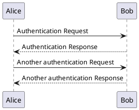
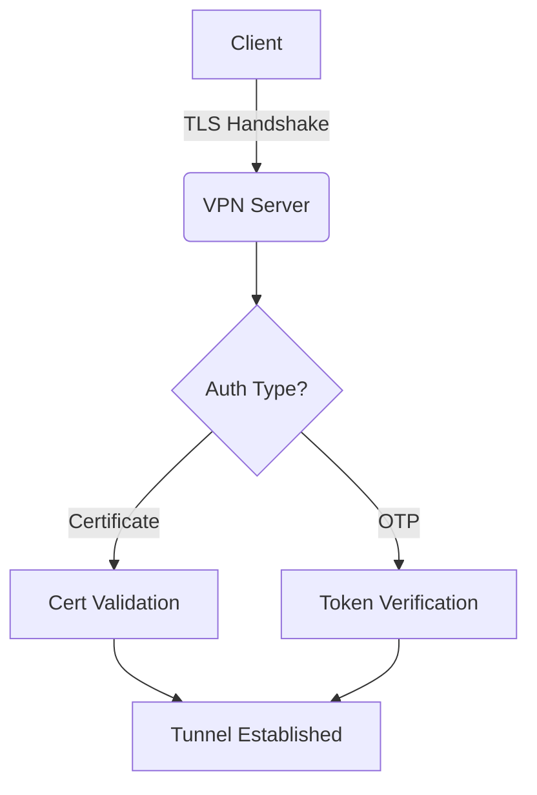
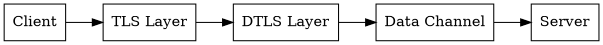
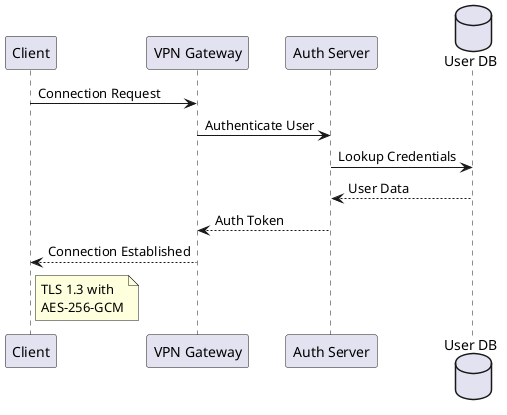
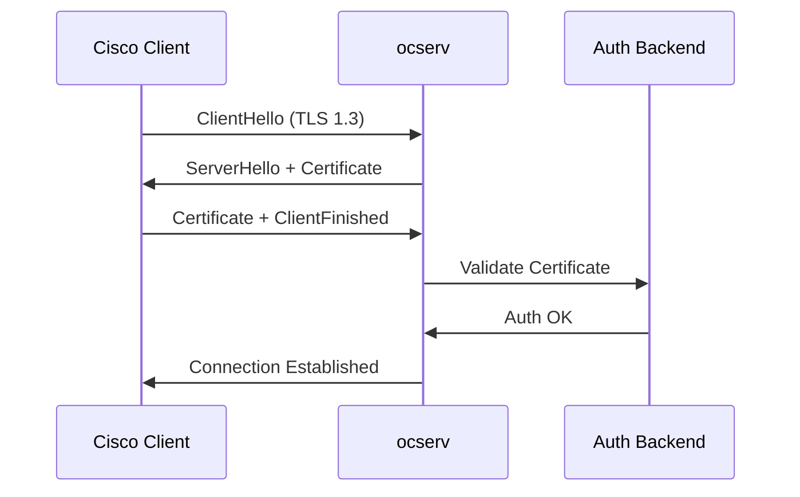

# Creating Diagrams with Kroki

This documentation site integrates **Kroki** - a universal diagram service that converts text-based diagram descriptions into images. Kroki supports multiple diagram types including PlantUML, Mermaid, GraphViz, and many more.

## Supported Diagram Types

Kroki supports the following diagram types:

- **PlantUML** - UML diagrams, sequence diagrams, component diagrams
- **Mermaid** - Flowcharts, sequence diagrams, Gantt charts
- **GraphViz** (dot) - Graph visualizations
- **Ditaa** - ASCII art diagrams
- **BlockDiag** - Block diagrams, sequence diagrams, network diagrams
- **C4-PlantUML** - C4 architecture diagrams
- **BPMN** - Business Process Model and Notation
- **Excalidraw** - Hand-drawn style diagrams
- **WaveDrom** - Digital timing diagrams
- **ERD** - Entity Relationship Diagrams
- And [many more](https://kroki.io/#support)

## Basic Usage

To create a diagram, use a fenced code block with the diagram type as the language identifier:

### PlantUML Example



### Mermaid Flowchart Example



### GraphViz (Dot) Example



## Advanced Examples

### PlantUML Sequence Diagram



### Mermaid Sequence Diagram



### C4 Architecture Diagram

```plantuml
@startuml
!include https://raw.githubusercontent.com/plantuml-stdlib/C4-PlantUML/master/C4_Container.puml

Person(user, "VPN User", "Remote worker")
System_Boundary(vpn, "VPN Infrastructure") {
    Container(gateway, "VPN Gateway", "ocserv", "Handles VPN connections")
    Container(auth, "Auth Service", "RADIUS/LDAP", "User authentication")
    ContainerDb(db, "Config DB", "PostgreSQL", "Configuration storage")
}

System_Ext(internet, "Internet", "Public network")

Rel(user, gateway, "Connects via", "TLS 1.3")
Rel(gateway, auth, "Authenticates", "RADIUS")
Rel(gateway, db, "Reads config", "SQL")
Rel(user, internet, "Accesses", "HTTPS")
@enduml
```

### Network Diagram with BlockDiag

```blockdiag
blockdiag {
    Internet [shape = cloud];
    Firewall [shape = box];
    VPN [shape = box, color = "#77FF77"];
    Internal [shape = ellipse];

    Internet -> Firewall -> VPN -> Internal;

    group {
        label = "DMZ";
        Firewall; VPN;
    }
}
```

### Timing Diagram with WaveDrom

```wavedrom
{
  "signal": [
    {"name": "clk", "wave": "p.....|..."},
    {"name": "dat", "wave": "x.345x|=.x", "data": ["head", "body", "tail", "data"]},
    {"name": "req", "wave": "0.1..0|1.0"},
    {},
    {"name": "ack", "wave": "1.....|01."}
  ]
}
```

## Technical Details

### Kroki Integration

The documentation site runs Kroki as a Docker container alongside the main documentation service:

- **Internal URL**: `http://kroki:8000` (used by Docusaurus during build)
- **Local Access**: `http://localhost:8000` (available for testing and Claude Code)
- **Format**: Diagrams are rendered as inline SVG (base64 encoded)

### Configuration

Kroki is configured in `docusaurus.config.js`:

```javascript
remarkPlugins: [
  [
    require('remark-kroki'),
    {
      server: process.env.KROKI_SERVER_URL || 'http://kroki:8000',
      output: 'img-svg-base64',
      types: ['plantuml', 'mermaid', 'graphviz', ...],
    },
  ],
],
```

### Local Development

When running the documentation locally with `npm start`, Kroki needs to be running:

```bash
# Start Kroki container
podman-compose -f compose.yaml up -d kroki

# Verify Kroki is running
curl http://localhost:8000/health

# Start Docusaurus dev server
npm start
```

### Using Kroki with Claude Code

Claude Code can generate diagrams by making requests to the local Kroki instance:

```bash
# Generate PlantUML diagram
curl -X POST http://localhost:8000/plantuml/svg \
  -H "Content-Type: text/plain" \
  -d '@startuml
Alice -> Bob: Hello
@enduml'

# Generate Mermaid diagram
curl -X POST http://localhost:8000/mermaid/svg \
  -H "Content-Type: text/plain" \
  -d 'graph TD
A-->B'
```

## Best Practices

### 1. Choose the Right Diagram Type

- **PlantUML**: Complex UML diagrams, sequence diagrams with rich features
- **Mermaid**: Simple flowcharts, quick diagrams (built into Docusaurus)
- **GraphViz**: Graph structures, dependency trees
- **C4-PlantUML**: Architecture diagrams following C4 model
- **WaveDrom**: Digital timing diagrams for protocol analysis

### 2. Keep Diagrams Simple

- Avoid overly complex diagrams (split into multiple diagrams)
- Use clear, descriptive labels
- Limit the number of elements (10-15 max for readability)

### 3. Document Your Diagrams

Add explanatory text before and after diagrams:

```markdown
The following diagram shows the authentication flow:

```plantuml
@startuml
...diagram code...
@enduml
```

Note: The authentication token is valid for 8 hours.
```

### 4. Version Control

Kroki diagrams are text-based, so they:
- ✅ Work well with Git (clear diffs)
- ✅ Can be reviewed in pull requests
- ✅ Are easy to update and maintain

### 5. Performance Considerations

- Diagrams are rendered during build time (not in browser)
- Rendered as base64 SVG (embedded in HTML)
- No external dependencies in production
- Fast page load times

## Examples from This Documentation

Throughout this documentation, you'll find diagrams created with Kroki:

- [Protocol Flow Diagrams](/docs/protocol/authentication) - PlantUML sequence diagrams
- [Architecture Diagrams](/docs/implementation/architecture) - C4-PlantUML
- [Network Topology](/docs/features/network) - BlockDiag
- [State Machines](/docs/protocol/connection) - GraphViz

## Troubleshooting

### Diagram Not Rendering

1. **Check Kroki is running**:
   ```bash
   podman ps | grep kroki
   curl http://localhost:8000/health
   ```

2. **Check diagram syntax**:
   - Visit [Kroki Playground](https://kroki.io/) to test your diagram
   - Validate PlantUML syntax at [PlantUML Online](http://www.plantuml.com/plantuml/)

3. **Check build logs**:
   ```bash
   npm run build
   # Look for kroki-related errors
   ```

### Diagram Type Not Supported

Verify the diagram type is enabled in `docusaurus.config.js` under `remarkPlugins` → `remark-kroki` → `types`.

### Slow Build Times

If builds are slow due to many diagrams:
- Consider using Mermaid for simple diagrams (built-in, no Kroki needed)
- Cache Kroki results (future enhancement)
- Run Kroki with more memory in `compose.yaml`

## Resources

- [Kroki Official Documentation](https://kroki.io/)
- [PlantUML Guide](https://plantuml.com/guide)
- [Mermaid Documentation](https://mermaid.js.org/)
- [GraphViz Documentation](https://graphviz.org/documentation/)
- [C4 Model](https://c4model.com/)

## Contributing Diagrams

When contributing diagrams to this documentation:

1. Use descriptive diagram code (add comments)
2. Test locally before committing
3. Keep diagram source formatted (indentation, line breaks)
4. Add alt text for accessibility (in progress)
5. Document complex diagrams in surrounding text

---

**Pro Tip**: Use Kroki's [online playground](https://kroki.io/) to prototype your diagrams before adding them to the documentation!
