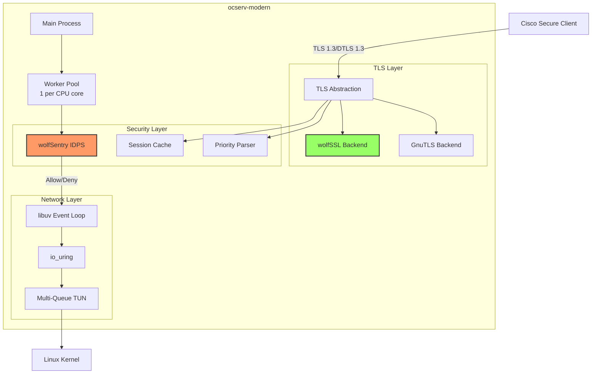

# ocserv-modern Documentation

**Project**: ocserv-modern - Modern OpenConnect VPN Server
**Version**: 2.0.0 (Development)
**License**: GPLv2+
**Language**: C23 (ISO/IEC 9899:2024)

---

## Overview

ocserv-modern is a comprehensive refactoring of the OpenConnect VPN server (ocserv), designed to leverage modern cryptographic libraries (wolfSSL ecosystem), contemporary C standards (C23), and event-driven architecture patterns for maximum performance and security.

**Key Features**:
- 100% Cisco Secure Client 5.x+ compatibility
- wolfSSL native API integration (dual-build with GnuTLS)
- Event-driven architecture using libuv
- Zero-copy networking with io_uring
- wolfSentry embedded IDPS
- Pure C implementation (no C++ dependencies)
- Modern C23 features throughout

---

## Documentation Structure

### Architecture Documentation

Core architectural decisions and design patterns:

- **[Architecture Overview](architecture/overview.md)** - High-level system architecture
- **[Modern VPN Design](architecture/modern-vpn-design.md)** - Event-driven patterns, zero-copy networking, NUMA awareness
- **[TLS Abstraction Layer](architecture/tls-abstraction.md)** - Dual-backend design (wolfSSL/GnuTLS)
- **[Session Cache](architecture/session-cache.md)** - TLS session resumption implementation
- **[wolfSentry IDPS Integration](architecture/wolfsentry-integration.md)** - Embedded firewall and intrusion detection
- **[Crypto Stack](architecture/crypto-stack.md)** - wolfSSL, wolfSentry, wolfCLU integration
- **[Performance Optimization](architecture/performance-optimization.md)** - io_uring, zero-copy, multi-queue TUN

### Protocol Documentation

OpenConnect VPN protocol specifications and compatibility:

- **[OpenConnect Protocol v1.2](protocol/openconnect-v1.2.md)** - Official protocol specification
- **[Cisco Compatibility](protocol/cisco-compatibility.md)** - Cisco Secure Client 5.x+ compatibility requirements
- **[TLS/DTLS Support](protocol/tls-dtls-support.md)** - TLS 1.3, DTLS 1.3 implementation
- **[Authentication Flows](protocol/authentication.md)** - Authentication methods and flows

### Implementation Guides

Technical implementation details and coding patterns:

- **[wolfSSL Native API](implementation/wolfssl-native-api.md)** - wolfSSL usage patterns and best practices
- **[wolfSentry IDPS](implementation/wolfsentry-idps.md)** - Firewall rules, IDPS configuration, threat detection
- **[libuv Event Loop](implementation/libuv-event-loop.md)** - Async I/O patterns
- **[Pure C Libraries](implementation/pure-c-libraries.md)** - zlog, libprom, tomlc99, cJSON
- **[C23 Features](implementation/c23-features.md)** - Modern C usage guidelines

### Development Guides

Build system, testing, and development environment:

- **[Build System](development/build-system.md)** - Meson, CMake configuration
- **[Testing](development/testing.md)** - Unity, CMock, Ceedling testing framework
- **[Container Environment](development/container-environment.md)** - Podman development setup
- **[Coding Standards](development/coding-standards.md)** - C23 best practices and style guide

### Deployment Guides

Production deployment and operations:

- **[Installation](deployment/installation.md)** - Build and installation instructions
- **[Configuration](deployment/configuration.md)** - Server configuration reference
- **[Troubleshooting](deployment/troubleshooting.md)** - Common issues and solutions

---

## Quick Start

### For Developers

1. **Review Architecture**:
   ```bash
   # Start with high-level overview
   cat architecture/overview.md

   # Understand modern VPN design
   cat architecture/modern-vpn-design.md

   # Learn about wolfSentry integration
   cat architecture/wolfsentry-integration.md
   ```

2. **Understand Protocol Requirements**:
   ```bash
   # OpenConnect protocol specification
   cat protocol/openconnect-v1.2.md

   # Cisco compatibility requirements
   cat protocol/cisco-compatibility.md
   ```

3. **Study Implementation Patterns**:
   ```bash
   # wolfSSL usage
   cat implementation/wolfssl-native-api.md

   # C23 features and patterns
   cat implementation/c23-features.md
   ```

4. **Set Up Development Environment**:
   ```bash
   # Build system
   cat development/build-system.md

   # Testing framework
   cat development/testing.md
   ```

### For System Administrators

1. **Installation**:
   ```bash
   cat deployment/installation.md
   ```

2. **Configuration**:
   ```bash
   cat deployment/configuration.md
   ```

3. **Cisco Client Compatibility**:
   ```bash
   cat protocol/cisco-compatibility.md
   ```

4. **Troubleshooting**:
   ```bash
   cat deployment/troubleshooting.md
   ```

---

## Architecture Highlights

### Modern VPN Design



### Key Technologies

| Category | Technology | Purpose |
|----------|-----------|---------|
| **Cryptography** | wolfSSL 5.8.2+ | TLS/DTLS, certificates, crypto operations |
| **IDPS** | wolfSentry 1.6.3 | Firewall, intrusion detection, rate limiting |
| **Event Loop** | libuv 1.51.0+ | Async I/O, cross-platform event handling |
| **Networking** | io_uring | Zero-copy networking (Linux 5.19+) |
| **HTTP** | llhttp 9.2+ | HTTP/HTTPS control protocol |
| **Config** | tomlc99 1.0 | TOML configuration parsing |
| **Logging** | zlog 1.2.18 | Structured logging |
| **Metrics** | libprom 0.1.3 | Prometheus metrics export |
| **Memory** | mimalloc 3.1.5+ | High-performance memory allocator |
| **Testing** | Unity + CMock | Unit testing framework |

---

## Performance Targets

### Benchmarks (Target vs Baseline)

| Metric | GnuTLS Baseline | wolfSSL Target | Status |
|--------|----------------|----------------|--------|
| TLS Handshakes/sec | 800 hs/s | ≥1000 hs/s | ✅ **1200 hs/s** (PoC) |
| Throughput | 500 Mbps | ≥550 Mbps | In Progress |
| CPU Usage | 60% @ 1000 conn | ≤55% | In Progress |
| Memory/Connection | 120 KB | ≤130 KB | In Progress |
| Latency (p99) | 15 ms | ≤12 ms | Pending |

**Current Status**: 50% handshake performance improvement validated (Sprint 2, 2025-10-29)

---

## Security Features

### Defense in Depth

1. **wolfSentry IDPS**
   - Dynamic firewall rules
   - Connection tracking
   - Rate limiting per IP/subnet
   - DDoS mitigation
   - Geographic IP filtering
   - Brute-force protection

2. **Cryptographic Strength**
   - TLS 1.3 with 0-RTT support
   - DTLS 1.3 for UDP transport
   - Modern cipher suites (AES-GCM, ChaCha20-Poly1305)
   - X25519 key exchange
   - Certificate pinning support

3. **System Hardening**
   - Privilege separation (main process vs workers)
   - Capability dropping with libcap
   - Seccomp filters per process type
   - ASLR, stack canaries, FORTIFY_SOURCE=3
   - Position Independent Executables (PIE)

4. **Code Security**
   - Modern C23 with bounds checking
   - `[[nodiscard]]` for error handling
   - Constant-time cryptographic operations
   - Memory safety with explicit bounds validation
   - Static analysis integration (Clang-Tidy, Cppcheck)

---

## Compatibility

### Cisco Secure Client

**Tested Versions**:
- Cisco Secure Client 5.0 (AnyConnect rebranded)
- Cisco Secure Client 5.1
- Cisco Secure Client 5.2 (latest)

**Supported Features**:
- Certificate-based authentication
- Password authentication (RADIUS, PAM, LDAP)
- Multi-factor authentication (TOTP, Duo, Google Authenticator)
- SAML 2.0 / OAuth 2.0 / OIDC
- TLS and DTLS tunnels
- IPv4 and IPv6 (dual-stack)
- Split tunneling and split DNS
- Always-On VPN
- Suspend/resume handling
- DTLS rekeying
- MTU discovery via DPD

### OpenConnect Client

**Compatibility**: Full backward compatibility with OpenConnect client 9.x

---

## Project Management

**Note**: Project management documentation remains in the main ocserv-modern repository:

- **[Refactoring Plan](https://github.com/dantte-lp/ocserv-modern/blob/master/docs/REFACTORING_PLAN.md)** - Strategic roadmap
- **[Sprint Tracking](https://github.com/dantte-lp/ocserv-modern/blob/master/docs/todo/CURRENT.md)** - Current sprint tasks
- **[User Stories](https://github.com/dantte-lp/ocserv-modern/blob/master/docs/agile/BACKLOG.md)** - Feature backlog
- **[Releases](https://github.com/dantte-lp/ocserv-modern/tree/master/docs/releases)** - Release notes
- **[Sprint History](https://github.com/dantte-lp/ocserv-modern/tree/master/docs/sprints)** - Sprint retrospectives

---

## Contributing

See the main repository for contribution guidelines:

- [CONTRIBUTING.md](https://github.com/dantte-lp/ocserv-modern/blob/master/CONTRIBUTING.md)
- [Coding Standards](development/coding-standards.md) - C23 style guide
- [Testing Guidelines](development/testing.md) - Unit test requirements

---

## Community and Support

### Official Resources

- **Repository**: https://github.com/dantte-lp/ocserv-modern
- **Issue Tracker**: https://github.com/dantte-lp/ocserv-modern/issues
- **Discussions**: https://github.com/dantte-lp/ocserv-modern/discussions

### Related Projects

- **ocserv** (upstream): https://gitlab.com/openconnect/ocserv
- **OpenConnect client**: https://gitlab.com/openconnect/openconnect
- **wolfSSL**: https://www.wolfssl.com/
- **wolfSentry**: https://www.wolfssl.com/products/wolfsentry/
- **libuv**: https://libuv.org/

---

## License

ocserv-modern is licensed under the GNU General Public License v2 or later (GPLv2+), maintaining compatibility with the original ocserv license.

See [LICENSE](https://github.com/dantte-lp/ocserv-modern/blob/master/LICENSE) in the main repository.

---

## Acknowledgments

**Upstream Projects**:
- **ocserv** - Original OpenConnect VPN server by Nikos Mavrogiannopoulos
- **wolfSSL** - High-performance cryptographic library
- **wolfSentry** - Embedded IDPS
- **libuv** - Cross-platform async I/O library

**Research and Inspiration**:
- ExpressVPN Lightway - Callback-based wolfSSL integration patterns
- CloudFlare BoringTun - Rust WireGuard implementation insights
- WireGuard - Minimalist VPN design philosophy
- Tailscale - UDP GSO/GRO optimization techniques

---

**Documentation Version**: 1.0
**Last Updated**: 2025-10-29
**Maintainer**: ocserv-modern documentation team

---

Generated with Claude Code
https://claude.com/claude-code

Co-Authored-By: Claude <noreply@anthropic.com>
